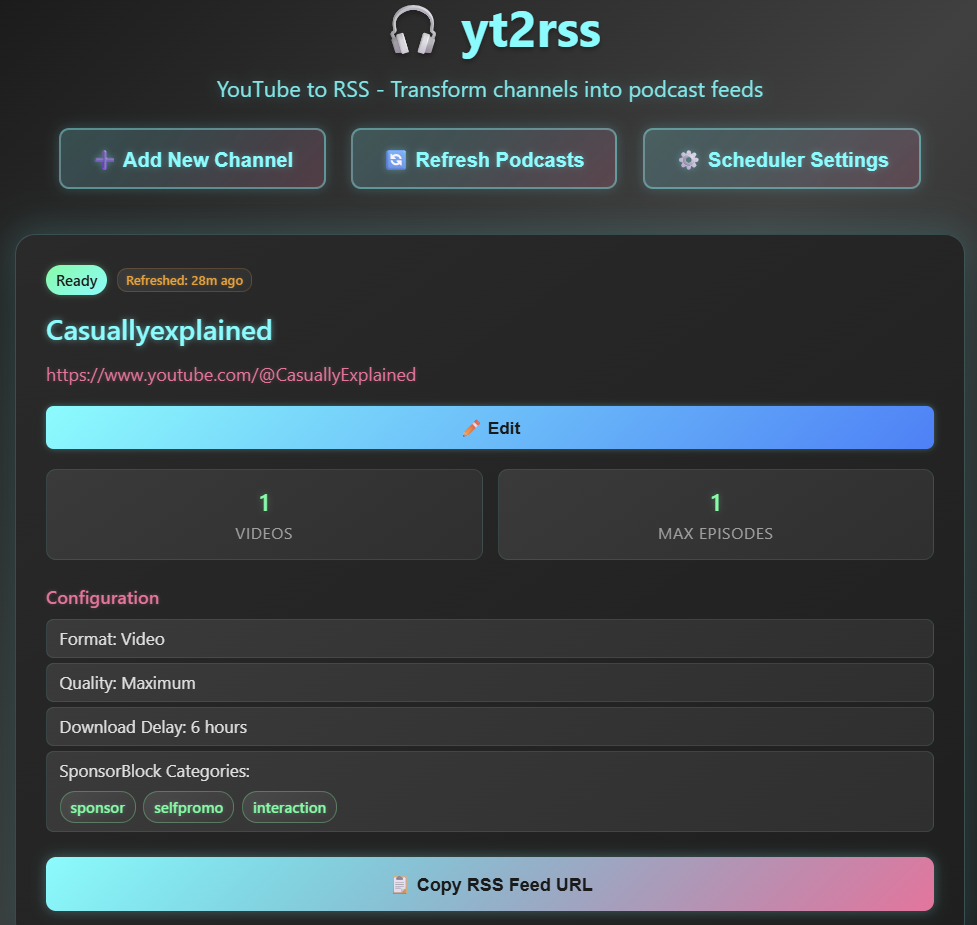

# YouTube to RSS Podcast Converter

A self-hosted solution that converts YouTube channels into podcast RSS feeds. Subscribe to your favorite YouTube channels in any podcast app, with automatic SponsorBlock integration to remove ads and promotional segments.

## Features

- **🎥 Automatic Video Downloads**: Monitor YouTube channels and download new videos in 720p MP4 format
- **🚫 SponsorBlock Integration**: Automatically remove sponsored segments, self-promotion, and other unwanted content
- **📻 Podcast RSS Feeds**: Generate standard RSS feeds compatible with any podcast app
- **⏰ Automated Scheduling**: Configurable refresh intervals for automatic updates
- **🌐 Web Interface**: Modern web UI for managing channels and monitoring status



## Quick Start

The easiest way to get started is using the pre-built Docker image:

```bash
# Create necessary directories
mkdir -p appdata/config appdata/podcasts

# Run the container
docker run -d \
  --name yt2rss \
  -p 5000:5000 \
  -e BASE_URL=http://localhost:5000 \
  -v $(pwd)/appdata/config:/app/appdata/config \
  -v $(pwd)/appdata/podcasts:/app/appdata/podcasts \
  cubicalbatch/yt2rss
```

### Access Your Podcasts

- **Web Interface**: Visit `http://localhost:5000` to manage channels and view status
- **RSS Feeds**: Subscribe to `http://localhost:5000/feeds/channel_name` in your podcast app
- **Direct Access**: Podcasts served at `http://localhost:5000/podcasts/channel_name/filename.mp4`

## Usage

### Web Interface

The web interface provides:

- **Channel Management**: Add, edit, and delete YouTube channels
- **Status Monitoring**: View download progress and last refresh times
- **Manual Refresh**: Trigger immediate updates
- **Configuration**: Adjust refresh intervals and settings

### Podcast Apps

Any standard podcast app can subscribe to your feeds:

1. Copy the RSS feed URL from the web interface
2. Add it as a new podcast subscription
3. Videos will appear as episodes with thumbnails
4. Automatic updates based on your refresh interval

### Channel Configuration

Add new channels through the web interface or by editing `appdata/config/channels.yaml`:

```yaml
refresh_interval_hours: 24  # Global refresh interval
channels:
  - name: example_channel
    url: https://www.youtube.com/@ExampleChannel
    max_episodes: 15
    download_delay_hours: 12
    sponsorblock_categories:
      - sponsor
      - selfpromo
```

### SponsorBlock Categories

Available categories for automatic removal:
- `sponsor`: Paid promotion segments
- `selfpromo`: Self-promotion and channel announcements
- `interaction`: Subscribe reminders and interaction requests
- `intro`: Channel intro sequences
- `outro`: End screens and credits
- `preview`: Video previews and recaps
- `music_offtopic`: Non-music segments in music videos
- `filler`: Filler content and tangents

## Environment Variables

- `BASE_URL`: Base URL for RSS feeds and podcast URLs (default: `http://localhost:5000`)
  - Example: `BASE_URL=https://your-domain.com`
  - Used in RSS feed URLs and media file links

## Security Notes

- Designed for local network use
- No authentication required
- All content served over HTTP

## Contributing

This is a self-hosted personal project. Feel free to fork and modify for your needs.

## Acknowledgments

This project is built with the help of several excellent open-source tools:

- **[yt-dlp](https://github.com/yt-dlp/yt-dlp)** - For downloading YouTube videos
- **[SponsorBlock](https://sponsor.ajay.app/)** - For community-driven sponsor segment detection
- **[FFmpeg](https://ffmpeg.org/)** - For video processing and manipulation

Special thanks to the maintainers and contributors of these projects.

## License

Open source - modify and distribute freely.